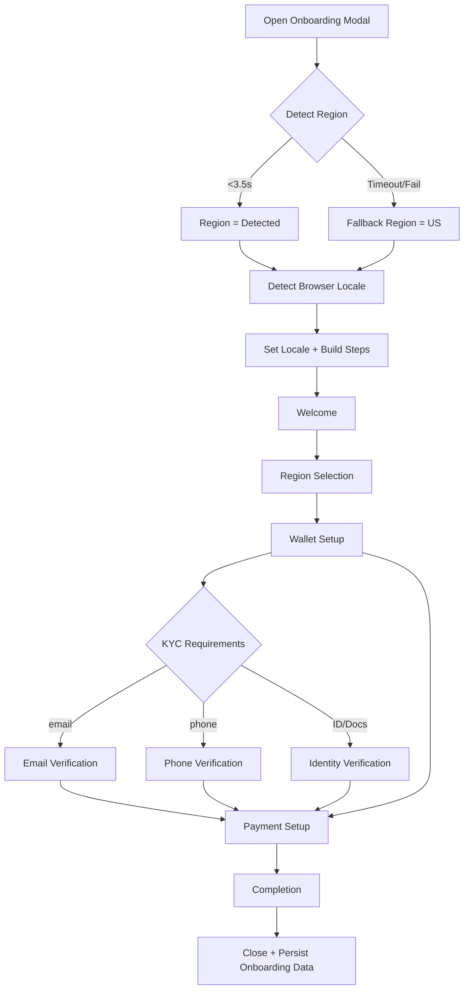
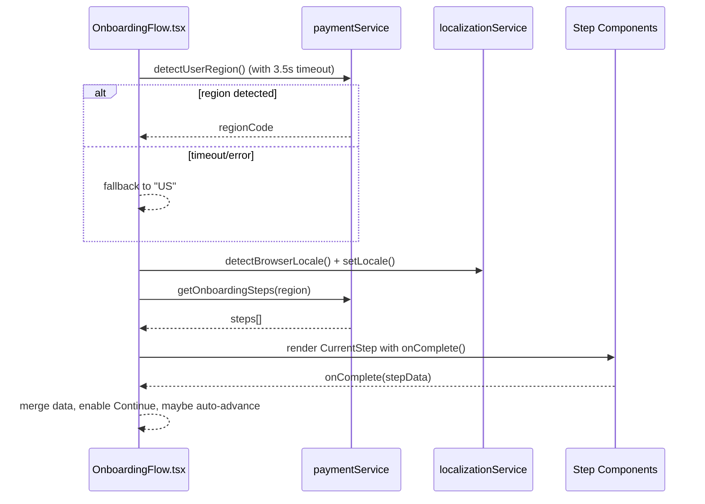
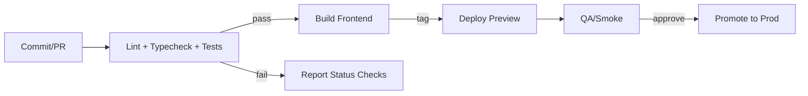
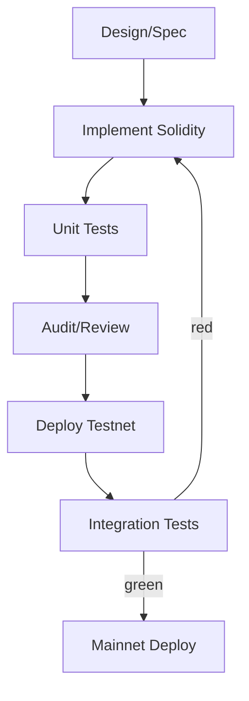
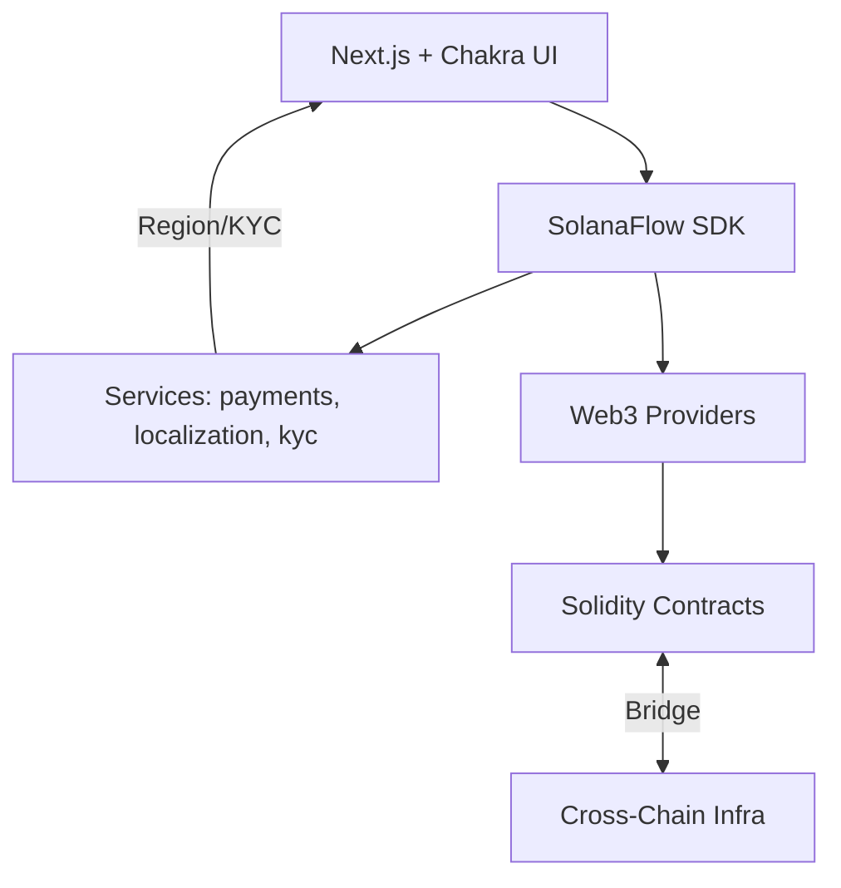

# SolanaFlow - Cross-Chain RWA Marketplace


## 🌟 Overview

**SolanaFlow** is a production-ready cross-chain marketplace for Real World Assets (RWA) that enables users to tokenize, buy, sell, and fractionalize real-world assets across multiple blockchain networks. Built with institutional-grade security, compliance features, and a stunning glassmorphism UI that provides a royal, professional experience.

### ✨ New Features

- **🎨 Royal Glassmorphism Design**: Premium UI with glass morphism effects, gold accents, and royal color scheme
- **📊 Advanced Dashboard**: Comprehensive portfolio management with real-time analytics
- **🏪 Professional Marketplace**: High-tech asset discovery and trading interface
- **📈 Market Analytics**: Deep insights into RWA market performance and trends
- **💼 Portfolio Management**: Detailed asset tracking with yield calculations
- **🔔 Real-time Notifications**: Live updates on transactions, yields, and market changes
- **⚡ Quick Actions**: Streamlined workflows for common tasks
- **🌐 Cross-chain Integration**: Seamless asset management across multiple blockchains

### 🎯 Key Features

- **Cross-Chain Compatibility**: Ethereum, Polygon, BSC, OneChain, and SUI support
- **Multi-Asset Support**: Real estate, carbon credits, precious metals, commodities, and more
- **Fractional Ownership**: Split high-value assets into affordable fractions
- **Advanced Marketplace**: Fixed price sales, auctions, and fractional trading
- **Compliance Ready**: Built-in KYC/AML compliance and regulatory frameworks
- **Upgradeable Contracts**: UUPS proxy pattern for future enhancements
- **Multi-Wallet Support**: MetaMask, WalletConnect, OneChain wallet integration

## 🏗️ Architecture

### Smart Contracts

```
contracts/
├── core/
│   └── RWARegistry.sol          # Central asset registry
├── tokens/
│   ├── RWAToken.sol             # ERC721 RWA NFTs
│   └── RWAFractional.sol        # ERC20 fractional tokens
├── bridge/
│   └── CrossChainBridge.sol     # Cross-chain asset transfers
├── marketplace/
│   └── RWAMarketplace.sol       # Trading marketplace
└── interfaces/
    └── IRWARegistry.sol         # Registry interface
```

### Frontend

```
src/
├── app/
│   ├── page.tsx                 # Royal glassmorphism landing page
│   ├── dashboard/
│   │   └── page.tsx             # Comprehensive dashboard
│   ├── marketplace/
│   │   └── page.tsx             # Advanced marketplace interface
│   ├── portfolio/
│   │   └── page.tsx             # Portfolio management
│   ├── analytics/
│   │   └── page.tsx             # Market analytics dashboard
│   ├── layout.tsx               # Root layout with royal theme
│   ├── providers.tsx            # Web3 providers (thirdweb v5)
│   └── globals.css              # Royal glassmorphism styles
├── components/
│   └── ui/
│       └── glass-card.tsx       # Glassmorphism card component
├── lib/
│   ├── thirdweb.ts             # Thirdweb v5 configuration
│   └── utils.ts                # Utility functions
└── config/
    └── contracts-*.json         # Contract configurations
```

## 🚀 Quick Start

### Prerequisites

- Node.js 18+
- npm or yarn
- MetaMask or compatible wallet

### Installation

1. **Clone the repository**
```bash
git clone https://github.com/omniflow/rwa-marketplace.git
cd rwa-marketplace
```

2. **Install dependencies**
```bash
npm install
```

3. **Set up environment variables**
```bash
cp .env.example .env
# Edit .env with your configuration
```

4. **Compile contracts**
```bash
npm run compile
```

5. **Deploy contracts**
```bash
# Deploy to OneChain Testnet
npm run deploy:onechain

# Deploy to other networks
npm run deploy:ethereum
npm run deploy:polygon
npm run deploy:bsc
```

6. **Start the frontend**
```bash
npm run dev
```

Visit `http://localhost:3000` to access the application.

## 🎨 UI Features

### Royal Glassmorphism Design
- **Glass Morphism Effects**: Backdrop blur with translucent glass cards
- **Royal Color Palette**: Deep royal blues, elegant golds, and premium gradients
- **Professional Typography**: Playfair Display for headings, Inter for body text
- **Smooth Animations**: Framer Motion powered transitions and micro-interactions
- **Responsive Design**: Mobile-first approach with adaptive layouts

### Advanced Components
- **Interactive Asset Cards**: Hover effects, real-time data, and quick actions
- **Dynamic Charts**: Portfolio performance and market analytics visualization
- **Smart Notifications**: Real-time updates with categorized alerts
- **Quick Action Panels**: Streamlined workflows for common tasks
- **Cross-chain Indicators**: Visual chain identification and status

### User Experience
- **Intuitive Navigation**: Tab-based interfaces with smooth transitions
- **Real-time Updates**: Live data refresh with loading states
- **Accessibility**: WCAG compliant with keyboard navigation
- **Performance**: Optimized animations and lazy loading
- **Dark Theme**: Professional dark mode with royal accents

## 🔧 Configuration

### Environment Variables

```env
# Deployment
PRIVATE_KEY=your_private_key_here
INFURA_API_KEY=your_infura_api_key

# OneChain Configuration
ONECHAIN_RPC_TESTNET=https://rpc-testnet.onelabs.cc:443
ONECHAIN_RPC_MAINNET=https://rpc.mainnet.onelabs.cc:443

# Frontend
NEXT_PUBLIC_THIRDWEB_CLIENT_ID=your_thirdweb_client_id
NEXT_PUBLIC_WALLET_CONNECT_PROJECT_ID=your_walletconnect_project_id
```

### Supported Networks

| Network | Chain ID | RPC Endpoint | Native Token |
|---------|----------|--------------|--------------|
| Ethereum | 1 | Infura | ETH |
| Polygon | 137 | Infura | MATIC |
| BSC | 56 | Public RPC | BNB |
| OneChain Testnet | 1001 | https://rpc-testnet.onelabs.cc:443 | OCT |
| OneChain Mainnet | 1000 | https://rpc.mainnet.onelabs.cc:443 | OCT |

## 📋 Asset Types Supported

### 🏠 Real Estate
- Residential properties
- Commercial buildings
- Land parcels
- REITs

### 🌱 Carbon Credits
- Forest conservation
- Renewable energy certificates
- Carbon offset projects
- Environmental credits

### 💎 Precious Metals
- Gold reserves
- Silver holdings
- Platinum investments
- Rare metals

### ⚡ Commodities
- Oil and gas
- Agricultural products
- Industrial materials
- Energy resources

## 🔐 Security Features

### Smart Contract Security
- **Upgradeable Contracts**: UUPS proxy pattern
- **Access Control**: Role-based permissions
- **Reentrancy Protection**: OpenZeppelin guards
- **Pause Mechanism**: Emergency stop functionality

### Compliance Features
- **KYC Integration**: User verification system
- **AML Compliance**: Transaction monitoring
- **Regulatory Framework**: Configurable compliance levels
- **Audit Trail**: Complete transaction history

## 🌉 Cross-Chain Bridge

### Supported Operations
- NFT transfers between chains
- Fractional token bridging
- Asset metadata synchronization
- Cross-chain marketplace listings

### Bridge Process
1. Lock asset on source chain
2. Generate bridge transaction
3. Relayer validates and processes
4. Mint equivalent asset on target chain

## 🏪 Marketplace Features

### Trading Options
- **Fixed Price Sales**: Instant purchase
- **Auctions**: Time-based bidding
- **Fractional Trading**: Buy/sell fractions
- **Cross-Chain Listings**: Multi-network visibility

### Payment Methods
- Native tokens (ETH, MATIC, BNB, OCT)
- Stablecoins (USDC, USDT, DAI)
- Custom ERC20 tokens

## 🧪 Testing

### Run Tests
```bash
# Compile contracts
npm run compile

# Run all tests
npm test

# Run specific test file
npx hardhat test test/RWARegistry.test.js
```

### Test Coverage
- Unit tests for all contracts
- Integration tests for cross-chain functionality
- Frontend component tests
- End-to-end marketplace tests

## 📚 API Documentation

### Contract Interactions

#### Register Asset
```solidity
function registerAsset(
    AssetType assetType,
    address tokenContract,
    uint256 chainId,
    string memory metadataURI,
    uint256 totalValue,
    uint256 totalSupply,
    ComplianceLevel requiredCompliance
) external returns (uint256 assetId)
```

#### Mint RWA Token
```solidity
function mint(
    address to,
    uint256 assetId,
    string memory tokenURI
) external returns (uint256 tokenId)
```

#### Bridge Asset
```solidity
function bridgeNFT(
    address tokenContract,
    uint256 tokenId,
    address recipient,
    uint256 targetChainId
) external payable
```

## 🚀 Deployment Guide

### OneChain Deployment

1. **Get OCT tokens from faucet**
```bash
# Visit: https://faucet-testnet.onelabs.cc:443
```

2. **Deploy to OneChain Testnet**
```bash
npm run deploy:onechain
```

3. **Verify deployment**
```bash
# Check deployment file
cat deployments/1001.json
```

### Multi-Chain Deployment

```bash
# Deploy to all supported chains
npm run deploy:all

# Or deploy individually
npm run deploy:ethereum
npm run deploy:polygon
npm run deploy:bsc
```

## 🤝 Contributing

1. Fork the repository
2. Create a feature branch
3. Make your changes
4. Add tests
5. Submit a pull request

### Development Guidelines
- Follow Solidity best practices
- Write comprehensive tests
- Document all functions
- Use consistent code style

## 📄 License

This project is licensed under the MIT License - see the [LICENSE](LICENSE) file for details.

## 🔗 Links

- **Website**: https://omniflow.io
- **Documentation**: https://docs.omniflow.io
- **Discord**: https://discord.gg/omniflow
- **Twitter**: https://twitter.com/omniflow_rwa

## 🆘 Support

For support and questions:
- Create an issue on GitHub
- Join our Discord community
- Email: support@omniflow.io


---

## 🧭 Onboarding Flow (Product + Tech)

The onboarding experience adapts dynamically to the user's region, locale, and KYC requirements. Steps are sourced from `src/services/paymentService.ts` and localized via `src/services/localizationService.ts`. The flow is orchestrated by `src/components/onboarding/OnboardingFlow.tsx`.

### Flow Overview



### State and Progression
- __Region detection timeout__: 3.5s with safe default to `US` and in-modal loader.
- __Auto-advance__: `Welcome` and `Completion` steps auto-advance after a short delay.
- __Proceed gating__: The Continue button enables only after a step calls `onComplete()`.
- __Resilience__: Initialization errors display a helpful message and proceed with defaults.
- __Data__: Completed step IDs deduplicated in `onboardingData.completedSteps`.

### Component Interaction



## ⚙️ Developer Workflows

### CI/CD (Conceptual)



### Contract Release Workflow



## 🧩 Problems Solved (Engineering Notes)

These notes capture real issues encountered and how we solved them for future maintainability.

### 1) Onboarding occasionally hung at start
- __Symptoms__: Modal showed nothing or remained stuck before first step.
- __Root cause__: Region detection could stall or fail, and the UI returned `null` during init.
- __Fix__: In `OnboardingFlow.tsx`
    - Added a 3.5s timeout wrapper around `paymentService.detectUserRegion()` with a default fallback to `US`.
    - Rendered an in-modal `Spinner` + helpful message instead of returning `null` until steps are ready.
    - Set safe defaults and error message on initialization failure.
    - Reset state on modal close to avoid stale state when reopening.
    - Added targeted debug logs to trace step progress.
    - Deduplicated `completedSteps` to avoid repeated entries.
- __Outcome__: No silent hangs; onboarding reliably progresses with clear UX feedback.

### 2) Proceed button didn’t enable on some steps
- __Cause__: Step didn’t signal completion or completion array had duplicates masking state.
- __Fix__: Ensured every step calls `onComplete()` with expected data. Deduplicated `completedSteps` and set `canProceed` on completion.
- __Outcome__: Consistent gating and smooth navigation.

### 3) Region change didn’t always allow moving forward
- __Cause__: After region update, `canProceed` wasn’t set when on `region_selection`.
- __Fix__: Explicitly set `canProceed(true)` on region change if current step is `region_selection`.
- __Outcome__: Users can continue immediately after choosing a region.

## 📊 Additional Diagrams

### High-Level Architecture



---

**Built with ❤️ by the SolanaFlow Team**
