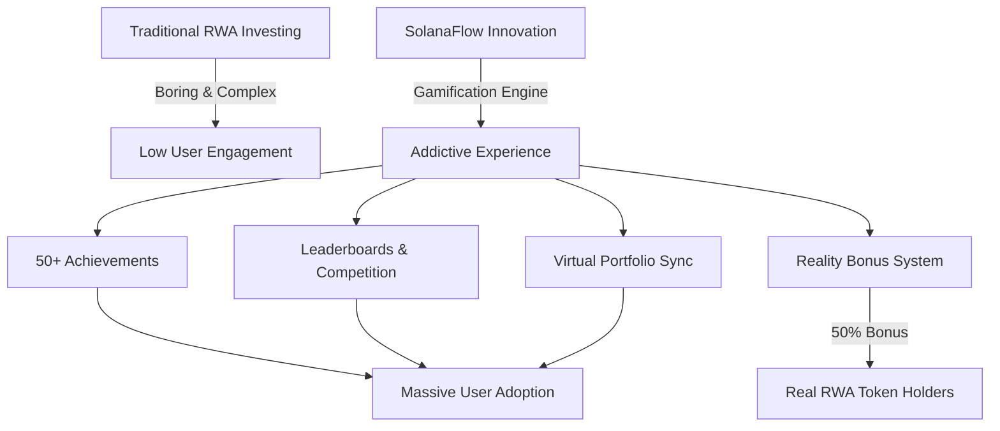
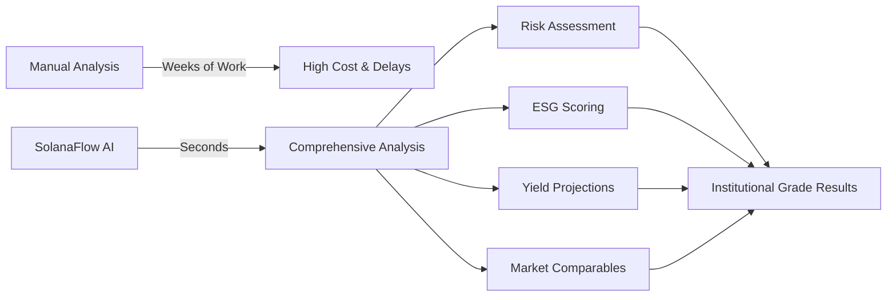
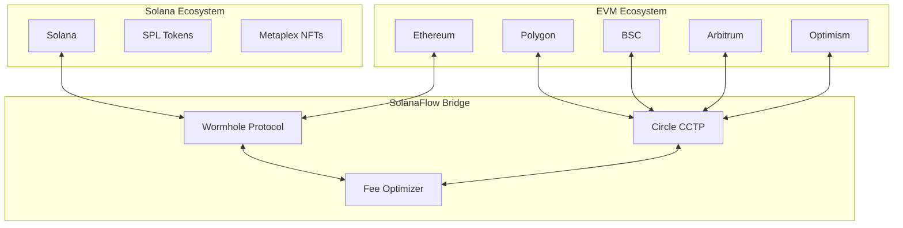
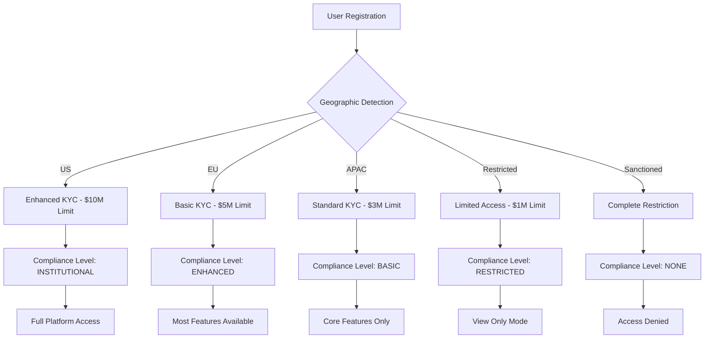
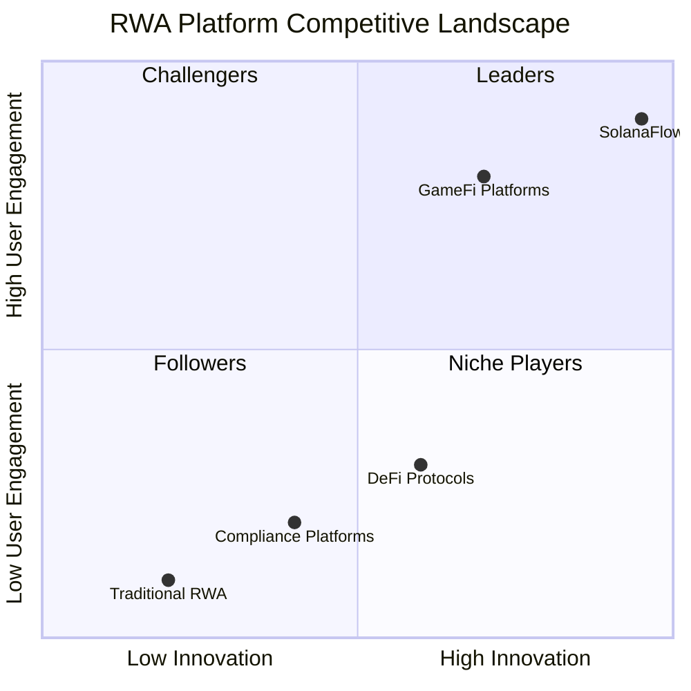
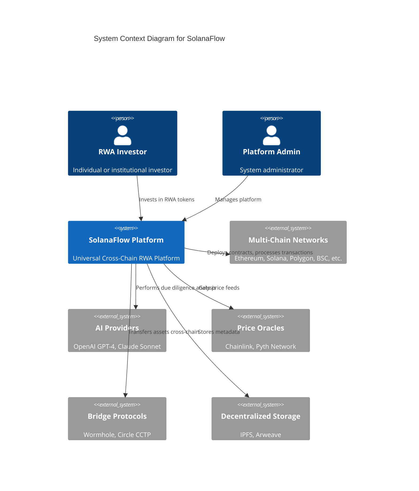
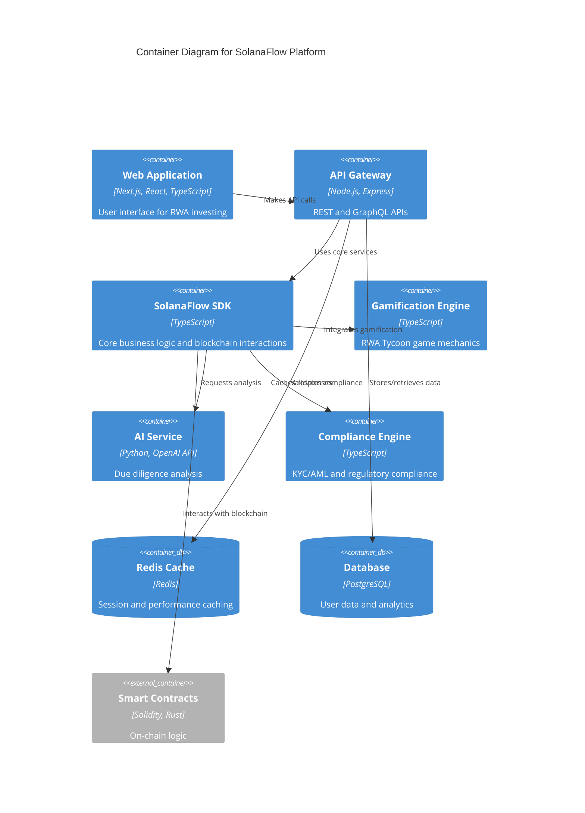
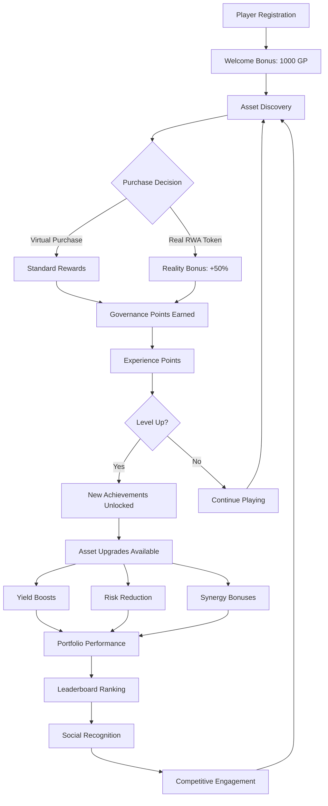
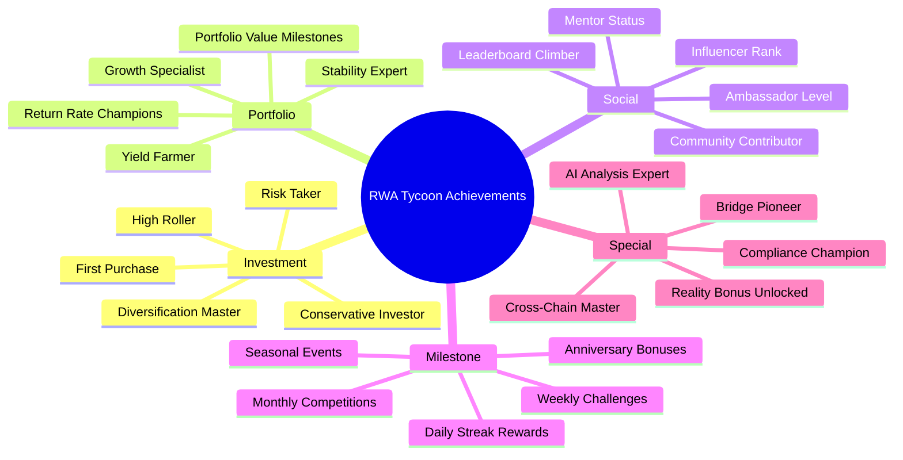
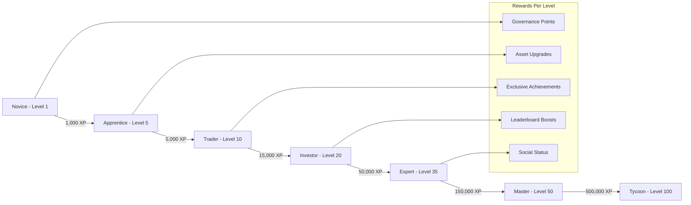

# SolanaFlow - Universal Cross-Chain RWA + Identity Router


## 🚀 **REVOLUTIONARY INNOVATIONS**

### 🎯 **World's First Gamified RWA Platform**


### 🤖 **AI-Powered Due Diligence Revolution**


### 🌉 **Universal Cross-Chain Architecture**


### 🛡️ **5-Level Compliance Innovation**


## 🌟 Overview

**SolanaFlow** is a production-ready universal cross-chain platform for Real World Assets (RWA) tokenization with integrated decentralized identity, AI-powered due diligence, gamification, and comprehensive compliance. Built for the MetaMask hackathon, qualifying for both Cross-Chain Interoperability and RWA Tokenization tracks. Features institutional-grade security, regulatory compliance, and an engaging gamified experience that transforms RWA investing into an addictive simulation game.

### ✨ Core Features

- **🎮 RWA Tycoon Gamification**: Transform RWA investing into an engaging simulation game with achievements, leaderboards, and virtual portfolio management
- **🤖 AI-Powered Due Diligence**: OpenAI/Claude integration for comprehensive RWA analysis, risk assessment, and yield projections
- **🛡️ Comprehensive Compliance**: Production-ready KYC/AML system with 5-level compliance, regional policies, and regulatory framework
- **🆔 Cross-Chain Identity**: NFT-based identity passport system with DID integration across Ethereum, Solana, and EVM chains
- **💰 Yield Vault System**: Aave/Yearn-style yield farming with aYield tokens, compound interest, and automated rewards
- **📊 Real-Time Analytics**: Professional market dashboard with TVL tracking, volume analytics, and performance metrics
- **🌉 Cross-Chain Bridge**: Wormhole integration for seamless asset transfers between Solana and EVM chains
- **🎨 Royal Glassmorphism UI**: Premium interface with glass morphism effects and professional UX design

### 🎯 Platform Capabilities

- **🌐 Universal Cross-Chain**: Ethereum, Polygon, BSC, Arbitrum, Optimism, Solana with Wormhole bridge
- **🏆 Gamified Experience**: 50+ achievements, player progression, daily rewards, leaderboards, and virtual asset upgrades
- **🔍 AI Due Diligence**: Institutional-grade analysis with risk scoring, ESG evaluation, and market comparables
- **📋 Regulatory Compliance**: US/EU/APAC regional policies, automated AML monitoring, and compliance scoring
- **🎫 Digital Identity**: ERC-721 + ERC-725 identity NFTs with verifiable credentials and cross-chain linking
- **💎 Yield Generation**: Fractional RWA tokens with automated yield distribution and compound rewards
- **📈 Professional Analytics**: Real-time market data, portfolio tracking, and performance insights
- **🔐 Enterprise Security**: UUPS upgradeable contracts, multi-sig governance, and emergency pause mechanisms

## 🎯 **COMPETITIVE ADVANTAGES**

### **Market Position**


### **Innovation Matrix**
| Feature | Traditional RWA | DeFi Protocols | SolanaFlow |
|---------|----------------|----------------|------------|
| **Gamification** | ❌ None | ❌ None | ✅ Full RWA Tycoon |
| **AI Due Diligence** | 🔶 Manual | ❌ None | ✅ GPT-4 + Claude |
| **Cross-Chain** | ❌ Single Chain | 🔶 Limited | ✅ Universal Bridge |
| **Compliance** | 🔶 Basic | ❌ None | ✅ 5-Level System |
| **User Experience** | 🔶 Traditional | 🔶 Technical | ✅ Consumer-Grade |
| **Yield Generation** | 🔶 Manual | ✅ Automated | ✅ Enhanced + Gamified |
| **Identity System** | ❌ Centralized | ❌ None | ✅ Cross-Chain DID |
| **Mobile Support** | 🔶 Limited | ❌ Poor | ✅ Full Responsive |

## 🏗️ **TECHNICAL ARCHITECTURE**

### **System Overview**


### **Component Architecture**


## 🚀 Quick Start

### Prerequisites

- Node.js 18+
- npm or yarn
- MetaMask wallet
- OpenAI/Claude API keys (for AI features)
- Infura/Alchemy RPC endpoints

### Installation

1. **Clone the repository**
```bash
git clone https://github.com/omniflow/omniflow-platform.git
cd omniflow-platform
```

2. **Install dependencies**
```bash
npm install
```

3. **Set up environment variables**
```bash
cp .env.example .env
# Configure the following:
# - OPENAI_API_KEY (for AI due diligence)
# - CLAUDE_API_KEY (backup AI provider)
# - INFURA_API_KEY (RPC endpoints)
# - PRIVATE_KEY (deployment wallet)
# - NEXT_PUBLIC_THIRDWEB_CLIENT_ID
```

4. **Deploy smart contracts**
```bash
# Compile all contracts
npm run compile

# Deploy core infrastructure
npm run deploy:ethereum
npm run deploy:polygon
npm run deploy:bsc

# Deploy Solana program
cd programs/omniflow-rwa
anchor build
anchor deploy
```

5. **Initialize services**
```bash
# Set up compliance system
node scripts/setup-compliance.js

# Initialize gamification
node scripts/setup-gamification.js

# Configure AI services
node scripts/setup-ai.js
```

6. **Start the platform**
```bash
npm run dev
```

Visit `http://localhost:3000` to access SolanaFlow.

### Demo Features

- **RWA Tycoon Game**: Complete onboarding to unlock the gamification dashboard
- **AI Due Diligence**: Analyze any RWA asset for comprehensive risk assessment
- **Cross-Chain Bridge**: Transfer assets between Ethereum and Solana
- **Yield Farming**: Deposit RWA tokens to earn automated yields
- **Identity Passport**: Create cross-chain identity with verifiable credentials

## 🎮 **RWA TYCOON GAMIFICATION ENGINE**

### **Game Mechanics Flow**


### **Achievement System**


### **Player Progression System**


## 🎮 RWA Tycoon Gamification

### Core Game Mechanics
- **Player Progression**: Level system with exponential XP curve and bonus rewards
- **Virtual Portfolio**: Mirror real RWA holdings with game mechanics and upgrades
- **Governance Points**: Primary currency earned through investments and daily activity
- **Achievement System**: 50+ unlockable achievements across Investment, Portfolio, Social, and Milestone categories
- **Daily Rewards**: Automated daily return processing with streak bonuses up to 7 days
- **Reality Bonus**: 50% bonus rewards for players who own actual RWA tokens

### Competitive Features
- **Leaderboards**: Portfolio Value, Returns, Governance Points, and Diversification rankings
- **Player Titles**: 5 rarity tiers (Common → Mythic) with unlock requirements
- **Asset Upgrades**: Yield boosts, risk reduction, and synergy unlocks using governance points
- **Market Events**: Dynamic events affecting yields (Bull Run, Market Crash, Regulatory Changes)
- **Portfolio Synergies**: Asset combination bonuses (Real Estate + Precious Metals = 10% stability)

### Addictive Design Elements
- **Achievement Notifications**: Celebration animations and toast notifications
- **Progress Visualization**: Level progression bars and achievement completion tracking
- **Rarity Collection**: Color-coded rarity system creating collection desire
- **Real-time Competition**: Live leaderboard updates driving competitive engagement
- **Streak Mechanics**: Daily login rewards with increasing multipliers

## 🤖 AI-Powered Due Diligence

### Analysis Capabilities
- **Risk Assessment**: 5-level scoring (VERY_LOW to VERY_HIGH) with detailed factors and mitigations
- **Yield Projection**: AI-calculated APY suggestions with confidence scores and market comparables
- **ESG Scoring**: Environmental, Social, Governance analysis (0-100 scale) with improvement recommendations
- **KYC Risk Profile**: Compliance level determination with verification step recommendations
- **Jurisdiction Analysis**: Country risk assessment, regulations, compliance requirements, tax implications

### AI Integration
- **Multi-Provider Support**: OpenAI GPT-4 Turbo and Claude Sonnet with intelligent fallback
- **Specialized Prompts**: RWA-specific analysis prompts for different asset classes
- **Performance Optimization**: 24-hour intelligent caching with automatic cleanup
- **Batch Processing**: Multiple asset analysis with concurrency control
- **Data Validation**: Comprehensive JSON response validation and error handling

### Asset Coverage
- **Real Estate**: Occupancy rates, cap rates, NOI, market cycles analysis
- **Precious Metals**: Volatility assessment, storage verification, purity analysis
- **Carbon Credits**: Environmental impact, verification standards, regulatory compliance
- **Art & Collectibles**: Provenance verification, market liquidity, subjective valuation risks
- **Commodities**: Price volatility, supply chain risks, storage considerations

## 🔧 Configuration

### Environment Variables

```env
# Deployment
PRIVATE_KEY=your_private_key_here
INFURA_API_KEY=your_infura_api_key

# OneChain Configuration
ONECHAIN_RPC_TESTNET=https://rpc-testnet.onelabs.cc:443
ONECHAIN_RPC_MAINNET=https://rpc.mainnet.onelabs.cc:443

# Frontend
NEXT_PUBLIC_THIRDWEB_CLIENT_ID=your_thirdweb_client_id
NEXT_PUBLIC_WALLET_CONNECT_PROJECT_ID=your_walletconnect_project_id
```

### Supported Networks

| Network | Chain ID | RPC Endpoint | Native Token |
|---------|----------|--------------|--------------|
| Ethereum | 1 | Infura | ETH |
| Polygon | 137 | Infura | MATIC |
| BSC | 56 | Public RPC | BNB |
| OneChain Testnet | 1001 | https://rpc-testnet.onelabs.cc:443 | OCT |
| OneChain Mainnet | 1000 | https://rpc.mainnet.onelabs.cc:443 | OCT |

## 📋 Asset Types Supported

### 🏠 Real Estate
- Residential properties
- Commercial buildings
- Land parcels
- REITs

### 🌱 Carbon Credits
- Forest conservation
- Renewable energy certificates
- Carbon offset projects
- Environmental credits

### 💎 Precious Metals
- Gold reserves
- Silver holdings
- Platinum investments
- Rare metals

### ⚡ Commodities
- Oil and gas
- Agricultural products
- Industrial materials
- Energy resources

## 🛡️ Comprehensive Compliance System

### Compliance Architecture
- **5-Level System**: NONE, BASIC, ENHANCED, INSTITUTIONAL, RESTRICTED
- **Regional Policies**: US, EU, Asia Pacific, Restricted, Sanctioned with custom rules
- **Risk Assessment**: LOW, MEDIUM, HIGH, CRITICAL with automatic scoring
- **KYC Integration**: Identity Passport NFT system with verifiable credentials
- **Blacklist/Whitelist**: Management with reason tracking and audit trails

### Regulatory Compliance
- **US Regulations**: Enhanced KYC, $10M transaction limits, additional verification requirements
- **EU Regulations**: Basic KYC, $5M transaction limits, GDPR compliance
- **Sanctioned Regions**: Complete restriction with zero transaction limits
- **Geographic Enforcement**: IP detection and automatic policy application
- **Compliance Expiry**: Automatic renewal alerts and re-verification workflows

### AML Monitoring
- **Suspicious Activity Detection**: Automated pattern recognition and flagging
- **Transaction Monitoring**: Real-time analysis of all platform transactions
- **Risk Scoring**: Dynamic user risk assessment based on activity patterns
- **Compliance Reporting**: Automated generation of regulatory reports
- **Audit Trail**: Complete immutable record of all compliance actions

## 🔐 Enterprise Security

### Smart Contract Security
- **UUPS Upgradeable**: Future-proof contract architecture with admin controls
- **Multi-Signature**: Governance actions require multiple authorized signatures
- **Role-Based Access**: Granular permissions with OpenZeppelin AccessControl
- **Emergency Pause**: Circuit breaker functionality for critical situations
- **Reentrancy Protection**: Comprehensive guards on all state-changing functions

### Identity & Authentication
- **Cross-Chain Identity**: ERC-721 + ERC-725 identity NFTs with DID integration
- **Verifiable Credentials**: W3C standard credentials with cryptographic proofs
- **Multi-Wallet Linking**: Connect multiple addresses with signature verification
- **EIP-4361 Compatibility**: Sign-In with Ethereum standard implementation
- **Cross-Chain Sync**: Automatic identity synchronization via Wormhole/LayerZero

## 💰 Advanced Yield Vault System

### Vault Architecture
- **aYield Tokens**: ERC20 share tokens representing proportional vault ownership
- **Aave/Yearn Patterns**: Industry-standard share-based accounting system
- **Price Appreciation**: Share value increases over time through yield accumulation
- **Compound Interest**: Automatic reinvestment of yields for exponential growth
- **Multi-Asset Vaults**: Separate vaults for different RWA asset classes

### Yield Generation
- **Demo APY**: 5% annual percentage yield for demonstration purposes
- **Real-Time Calculation**: Yield computed based on deposit time and current rates
- **Daily Processing**: Automated daily yield distribution with streak bonuses
- **Performance Fees**: 10% performance, 2% management, 0.5% withdrawal fees
- **Gas Optimization**: Batch operations for efficient yield distribution

### Security & Controls
- **OpenZeppelin Security**: ReentrancyGuard, Pausable, Ownable, SafeERC20
- **Emergency Shutdown**: Circuit breaker with emergency withdrawal capabilities
- **Upgrade Mechanism**: UUPS proxy pattern for future enhancements
- **Access Controls**: Role-based permissions for administrative functions
- **Audit Trail**: Complete transaction history and yield distribution logs

### Integration Features
- **Gamification Sync**: Vault yields contribute to RWA Tycoon progression and rewards
- **Compliance Integration**: All vault operations subject to compliance verification
- **Cross-Chain Deployment**: Vaults available on all supported networks
- **API Access**: RESTful and GraphQL endpoints for external integrations
- **Real-Time Analytics**: Live performance tracking and portfolio insights

## 🌉 Universal Cross-Chain Bridge

### Supported Networks
- **EVM Chains**: Ethereum, Polygon, BSC, Arbitrum, Optimism
- **Solana**: Native SPL token and NFT support
- **Bridge Protocols**: Wormhole for Solana ↔ EVM, Circle CCTP for EVM ↔ EVM
- **Asset Types**: RWA NFTs, fractional tokens, native assets, and stablecoins

### Bridge Features
- **Quick Bridge Interface**: User-friendly chain and token selection
- **Real-Time Status**: 4-step process tracking with transaction hashes
- **Fee Optimization**: Dynamic fee calculation and route optimization
- **Bridge History**: Complete transaction history with retry functionality
- **Mobile Responsive**: Elegant design with Framer Motion animations

### Bridge Process
1. **Approve Token**: User approves token spending on source chain
2. **Lock on Source**: Asset locked in bridge contract with event emission
3. **Validate Transfer**: Bridge validators confirm and sign transaction
4. **Mint on Destination**: Equivalent asset minted on target chain

### Technical Implementation
- **Wormhole Integration**: Core messaging for Ethereum ↔ Solana transfers
- **CCTP Support**: Circle's Cross-Chain Transfer Protocol for stablecoins
- **Contract Addresses**: Deployed on all supported networks with verification
- **Event Monitoring**: Real-time bridge status updates via WebSocket connections
- **Error Handling**: Comprehensive retry logic and user feedback systems

## 🏪 Marketplace Features

### Trading Options
- **Fixed Price Sales**: Instant purchase
- **Auctions**: Time-based bidding
- **Fractional Trading**: Buy/sell fractions
- **Cross-Chain Listings**: Multi-network visibility

### Payment Methods
- Native tokens (ETH, MATIC, BNB, OCT)
- Stablecoins (USDC, USDT, DAI)
- Custom ERC20 tokens

## 🧪 Testing

### Run Tests
```bash
# Compile contracts
npm run compile

# Run all tests
npm test

# Run specific test file
npx hardhat test test/RWARegistry.test.js
```

### Test Coverage
- Unit tests for all contracts
- Integration tests for cross-chain functionality
- Frontend component tests
- End-to-end marketplace tests

## 📚 API Documentation

### Contract Interactions

#### Register Asset
```solidity
function registerAsset(
    AssetType assetType,
    address tokenContract,
    uint256 chainId,
    string memory metadataURI,
    uint256 totalValue,
    uint256 totalSupply,
    ComplianceLevel requiredCompliance
) external returns (uint256 assetId)
```

#### Mint RWA Token
```solidity
function mint(
    address to,
    uint256 assetId,
    string memory tokenURI
) external returns (uint256 tokenId)
```

#### Bridge Asset
```solidity
function bridgeNFT(
    address tokenContract,
    uint256 tokenId,
    address recipient,
    uint256 targetChainId
) external payable
```

## 🚀 Deployment Guide

### OneChain Deployment

1. **Get OCT tokens from faucet**
```bash
# Visit: https://faucet-testnet.onelabs.cc:443
```

2. **Deploy to OneChain Testnet**
```bash
npm run deploy:onechain
```

3. **Verify deployment**
```bash
# Check deployment file
cat deployments/1001.json
```

### Multi-Chain Deployment

```bash
# Deploy to all supported chains
npm run deploy:all

# Or deploy individually
npm run deploy:ethereum
npm run deploy:polygon
npm run deploy:bsc
```

## 🤝 Contributing

1. Fork the repository
2. Create a feature branch
3. Make your changes
4. Add tests
5. Submit a pull request

### Development Guidelines
- Follow Solidity best practices
- Write comprehensive tests
- Document all functions
- Use consistent code style

## 📄 License

This project is licensed under the MIT License - see the [LICENSE](LICENSE) file for details.

## 🔗 Links

- **Website**: https://omniflow.io
- **Documentation**: https://docs.omniflow.io
- **Discord**: https://discord.gg/omniflow
- **Twitter**: https://twitter.com/omniflow_rwa

## 🆘 Support

For support and questions:
- Create an issue on GitHub
- Join our Discord community
- Email: support@omniflow.io


---

## 🧭 Onboarding Flow (Product + Tech)

The onboarding experience adapts dynamically to the user's region, locale, and KYC requirements. Steps are sourced from `src/services/paymentService.ts` and localized via `src/services/localizationService.ts`. The flow is orchestrated by `src/components/onboarding/OnboardingFlow.tsx`.

### Flow Overview


### State and Progression
- __Region detection timeout__: 3.5s with safe default to `US` and in-modal loader.
- __Auto-advance__: `Welcome` and `Completion` steps auto-advance after a short delay.
- __Proceed gating__: The Continue button enables only after a step calls `onComplete()`.
- __Resilience__: Initialization errors display a helpful message and proceed with defaults.
- __Data__: Completed step IDs deduplicated in `onboardingData.completedSteps`.

### Component Interaction


## ⚙️ Developer Workflows

### CI/CD (Conceptual)


### Contract Release Workflow


## 🧩 Problems Solved (Engineering Notes)

These notes capture real issues encountered and how we solved them for future maintainability.

### 1) Onboarding occasionally hung at start
- __Symptoms__: Modal showed nothing or remained stuck before first step.
- __Root cause__: Region detection could stall or fail, and the UI returned `null` during init.
- __Fix__: In `OnboardingFlow.tsx`
    - Added a 3.5s timeout wrapper around `paymentService.detectUserRegion()` with a default fallback to `US`.
    - Rendered an in-modal `Spinner` + helpful message instead of returning `null` until steps are ready.
    - Set safe defaults and error message on initialization failure.
    - Reset state on modal close to avoid stale state when reopening.
    - Added targeted debug logs to trace step progress.
    - Deduplicated `completedSteps` to avoid repeated entries.
- __Outcome__: No silent hangs; onboarding reliably progresses with clear UX feedback.

### 2) Proceed button didn’t enable on some steps
- __Cause__: Step didn’t signal completion or completion array had duplicates masking state.
- __Fix__: Ensured every step calls `onComplete()` with expected data. Deduplicated `completedSteps` and set `canProceed` on completion.
- __Outcome__: Consistent gating and smooth navigation.

### 3) Region change didn’t always allow moving forward
- __Cause__: After region update, `canProceed` wasn’t set when on `region_selection`.
- __Fix__: Explicitly set `canProceed(true)` on region change if current step is `region_selection`.
- __Outcome__: Users can continue immediately after choosing a region.

## 📊 Additional Diagrams

### High-Level Architecture


---

**Built with ❤️ by the SolanaFlow Team**
